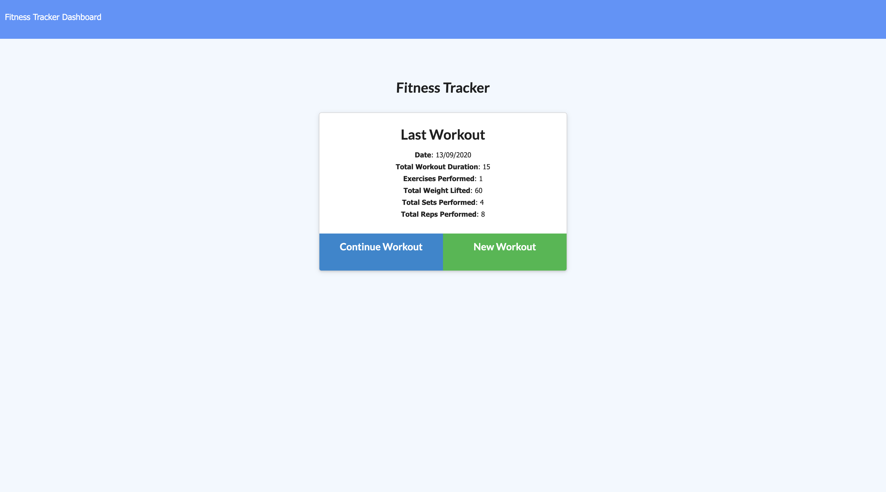

# Fitness tracker
  

  ## Preview
  

  ## Description
  * Fitness Tracker is a workout app that allow users to record their recent workout, it helps users to keep track of their exercises.
  * Deployed application on Heroku: https://fierce-bastion-39459.herokuapp.com/

  ## Table of Contents
  * [Installation](#installation)
  * [Usage](#Usage)
  * [License](#License)
  * [Contributing](#Contributing)
  * [Questions](#Questions)

  ## Installation
  To install necessary dependencies, run the following command:

      npm i

  ## Usage
  1. Fork this repository to your folder and install dependencies.
  2. Install dependencies.
  3. Run `node server.js` in Node.js.
  4. Go to your localhost in browser, and start using the app.

Alternatively, to use this app directly, click on the Heroku link under [Description](#Description). Click on "New Workout" started to create new exercise or click "Continue" to update or complete your last workout.

  ## License
  * MIT

  ## Contributing
  The app is contributed by Melody Lo and Trilogy Education Services.

  ## Questions
  * If you have any questions, feel free to contact me via email: yiling.melody.lo@gmail.com
  * My GitHub profile: https://github.com/roukell

  